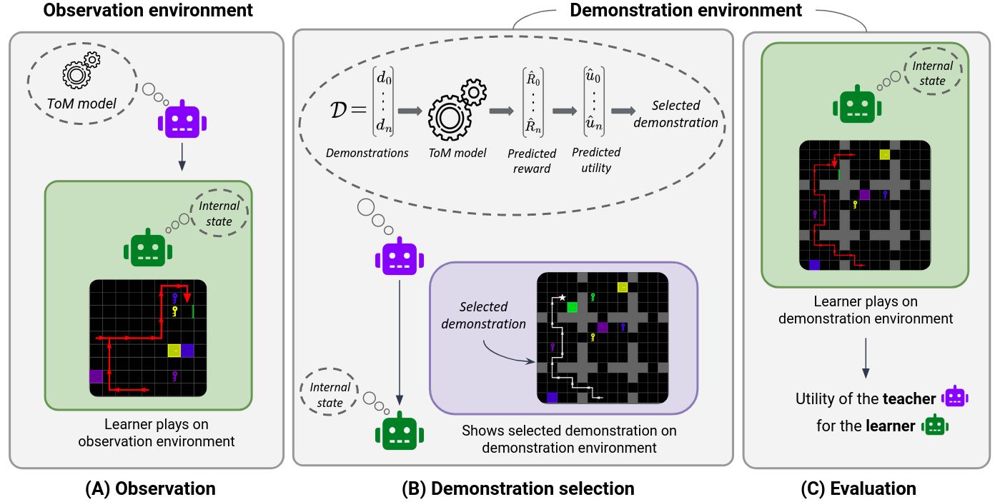

# Utility-based Adaptive Teaching Strategies using Bayesian Theory of Mind

This repository contains the code used in the paper under review 'Utility-based Adaptive Teaching Strategies using Bayesian Theory of Mind' 📄.

## Webpage 🌐

For a quick overview of our general framework with animated explanations, visit our [webpage](https://teacher-with-tom.github.io./).

## General frameworl ⚙️

In this paper, we introduce machine teachers equipped with a Bayesian Theory of Mind (ToM) model of the learner. The teacher is able to fits its ToM model to an observed learner and adapt the demonstration to the learner's goal and sensory capacity.



**Figure:** This illustration represents our general framework, which consists of two environments:

**(A)** In the first environment, the learner  behaves while the teacher  observes the learner's behavior.

**(B)** In the second environment, the learner benefits from a demonstration chosen by the teacher from a set of available demonstrations. The learner's goal and sensory capability can vary, affecting the usefulness of a demonstration. ToM-teachers use the learner's observations to model its internal state as probability distributions over its goal and receptive field size. Based on this model, the teacher can calculate the expected utilities of the available demonstrations and choose the most beneficial one.

**(C)** The teachers are evaluated based on the utility measured from the demonstration they select for the learner they have observed.

## Reproducibility 📊

To set up the required Conda environment for this project, you can follow these steps:

#### Clone the Repository:


```
git clone https://github.com/teacher-with-ToM/Utility-based_Adaptive_teaching.git
cd Utility-based_Adaptive_teaching
```

#### Create the Conda Environment:
Use the provided `requirements.txt` file to create the 'teacher-with-ToM' Conda environment. Run the following command:

```
conda create --name teacher-with-ToM --file requirements.txt
```

This will create a new Conda environment named 'teacher-with-ToM' and install all the necessary dependencies listed in the `requirements.txt` file.

#### Activate the Environment:
You can activate the `teacher-with-ToM` environment using the following command:

```
conda activate teacher-with-ToM
```

Or choose `teacher-with-ToM` as the kernel of the Jupyter notebook.

#### Reproduce the results:

The `notebooks` folder contains three Jupyter notebooks that can be used to reproduce the results of the paper:

- **'experiments_Bayesian.ipynb'**: This notebook presents the environments, the different learners, and ToM-teachers, as well as the complete interaction.

- **'stat_utility.ipynb'**: In this notebook, you will find the statistical tests used to compute the main results of the paper. The outputs of the statistical tests are saved in the `outputs` folder. To generate the figures of the main paper and Appendix (F), simply run the cells in the `Display results` section of the notebook.

- **'stat_ToM.ipynb'**: This notebook contains the statistical tests used to generate the results presented in Appendix D. To generate the figures of the paper, run the cells in the `Display results` section of the notebook.
